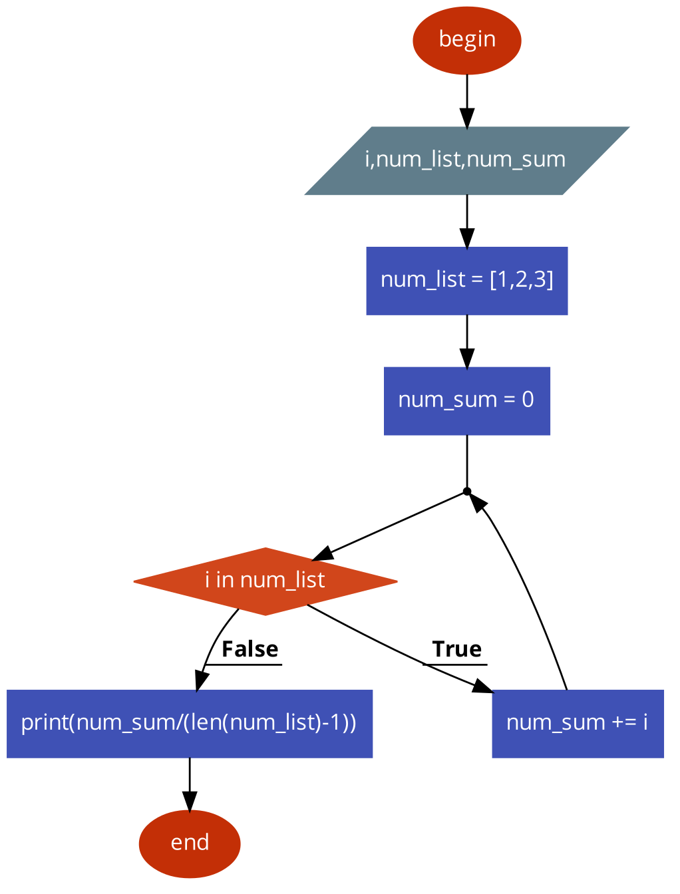

# Python2Pseudocode
Python2Pseudocode - is a cli-tool which converts python code to pseudocode for [code2flow](http://app.code2flow.com "code2flow") site.

```python
num_list = [1,2,3]
num_sum = 0
for i in num_list:
    num_sum += i
print(num_sum/(len(num_list)-1))
```
Converts to
```
begin

/i,num_list,num_sum/

|num_list = [1,2,3]|

|num_sum = 0|

while(i in num_list){
|num_sum += i|

}

|print(num_sum/(len(num_list)-1))|

end
```
By [code2flow](http://app.code2flow.com "code2flow") converts to


## Installation
```shell
cd 'Python2Pseudocode_dir' 
pip install -e .
```

## Usage

To get pseudocode of file run it:
```shell
py2ps file_path
```
Or if you want to convert functions(in current file) to procedures run it:
```shell
py2ps file_path procedural
```
**This option is experemental**. At the moment,  it works with code like this: 
```python
def get_avr_arithmetic(num_list):
    num_sum = 0

    for i in num_list:
        num_sum += i

    return num_sum/(len(num_list)-1)
print(get_avr_arithmetic([[1,2,3]]))
```